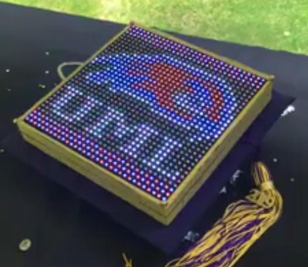

# 24 bit to 9 bit Color Converter

My sister had this RGB Matrix panel that she had wired up to use for her gradutation cap in high school. The RGB Matrix panel only accepted 9 bit color so naturally there was going to be an issue using the regular 24 bit color images that we normally have. She had the issue of getting the coding part done so I thought I'd help her translate regular images to 9 bit color images.

Most programs do not let you select 9 bit color so what I did was take the 24 bit color code (8 bits for red, green, blue) and then for each one take and linearly map from 0-255 (8 bits) to 0-7 (3 bits). Then told my sister to use these specific colors to make it map nicely for the 3 bits of information.

So what I did was write a python script (this repo) to do all this and output a fat array in Arduino code. This had some issues with using up all the RAM space on 1-2 images. So instead what I did was program memory get's loaded and unloaded as it happens so what I did in `main.1.py` was change the output to just be the code that would change the pixel on the display.

This is def not the most elegant of solutions for her case but she doesn't really care about elegance so that's where it ended. If you were to do this you'd probably want to load the data from a flash chip somewhere rather than save it into the program memory like that.

This was the image used:

And then converted it was then put onto the arduino and it looks like this:
